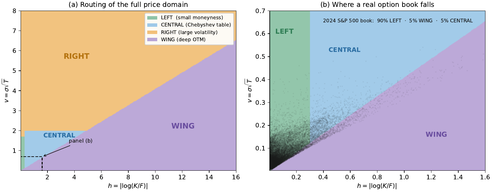
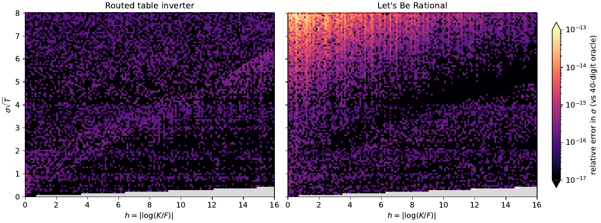
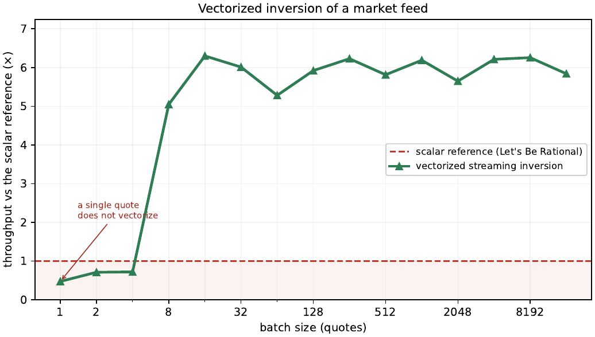

# volfi v0.2.0

`volfi` is a header-only C++17 reference implementation for inverting the Black–Scholes
price–to–implied-volatility map at machine precision.

Version 0.2.0 replaces the narrow quantile-identity kernel of v0.1 with a **routed,
vectorizable table inverter** that covers the full practical domain of a production
implied-volatility library (total volatility `v = sigma*sqrt(T)` up to ~8, log-moneyness
`h = |log(K/F)|` up to ~16.2) while remaining accurate to the last few units in the last
place and producing **bit-identical results from its scalar and SIMD paths**.

The engine is built on top of the v0.1 kernel (it reuses `volfi::qnorm`, the OTM context,
and the price/Halley primitives), so both versions coexist in the tree; v0.2.0 is the
current release.

The accompanying paper (`docs/volfi_v0.2.0_paper.pdf`) documents the method, the accuracy
certification, and the timing methodology in full.

## What it does

For an out-of-the-money normalized call with log-moneyness `h = |log(K/F)| > 0` and
undiscounted normalized price `c = C/F in (0,1)`, where

```
c = Phi(-h/v + v/2) - exp(h) * Phi(-h/v - v/2),   v = sigma*sqrt(T),
```

`volfi` returns the total implied variance `w = v^2` (and, on request, `sigma`).

A branchless per-quote predicate routes each `(h, c)` to one of four charts, each accurate
across its own region so that no single approximation is stretched past where it conditions
well:

| chart   | region                         | method                                             |
|---------|--------------------------------|----------------------------------------------------|
| CENTRAL | `h in [0.3, 6.65]`, `v <= 2`   | bivariate Chebyshev table in `W = h^2/(2w)`         |
| LEFT    | `h < 0.3`, `v <= 1.70`         | matched small-moneyness expansion                  |
| RIGHT   | `v > 1.70` / `h > 6.65`        | erf-free seed + fixed 3-step Householder on the exact equation |
| WING    | `W = h^2/(2w) >= 3`            | resurgent deep-OTM evaluator (erf-free), prices to `1e-320` |

The chart boundaries are fixed by branch-point analysis of the inverse map, not tuned.



*The four charts tile the feasible `(h, v)` plane, with boundaries fixed by the
maturity-independent branch-point geometry of the inverse map (left). Zooming into the
near-the-money corner (right) with a full year of tradeable 2024 S&P 500 quotes overlaid:
about 90% of a real book falls in the small-moneyness LEFT chart and a further 5% in the deep
wing, while the large-volatility RIGHT region that dominates the plane by area carries
essentially none.*

## Properties

- **Machine precision, uniformly.** Against a 40-digit `mpmath` oracle over the whole
  feasible domain: **zero points worse than `1e-15` relative in `sigma`**, worst case
  ~`8.3e-16` (about 5 ULP). The included golden vectors (`reproduce/oracle_*.bin`) certify
  this on every build.
- **Deterministic across builds.** The scalar entry and the AVX-512 / AVX2 batch drivers
  produce **bit-identical** output vectors, and all five reference builds
  (gcc/clang × AVX-512/AVX2/scalar) agree bit-for-bit. This is guaranteed by compiling with
  `-ffp-contract=off`, which turns every fused multiply-add into an explicit `std::fma` in
  the source so codegen cannot vary the fusion by translation unit, ISA, or compiler.
- **Total input contract.** `implied_variance_otm_checked` classifies every input
  (`ok`, `below_intrinsic`, `above_max`, `bad_input`, `out_of_domain`, `near_saturation`)
  and never returns silent garbage; invalid domains yield `NaN`.
- **Vectorized batch and streaming drivers** for the workload that live systems actually
  run — a whole book at once, then re-inverted each snapshot from the previous solution.



*Relative error in `sigma` across the `(h, v)` domain, against a 40-digit oracle. The routed
inverter (left) holds machine precision everywhere; the reference (right) matches it over most
of the plane but degrades near the intrinsic edge (`c → 1`, right chart) and in the deep wing,
where its reduced variable `beta = c·e^{-h/2}` underflows.*

## Performance (summary)

The whole point is that the routed inverter **vectorizes**: because every chart executes a
fixed, branchless operation count, eight (AVX-512) or four (AVX2) quotes advance through the
identical instruction stream in lockstep, where a data-dependent scalar iteration cannot. The
speed advantage is entirely that — it appears only when there is a batch to fill the SIMD
lanes, and grows with the register width.



*On a real 2024 S&P 500 feed, the vectorized streaming re-inversion sustains about five to six
times the throughput of the scalar reference, flat once a batch fills one SIMD register. A
single isolated quote cannot be vectorized and is the one regime the scalar reference still
wins.*

Measured on a quiet Intel Core i5-1145G7 (Linux, GCC 11.4, `-O3 -ffp-contract=off
-fno-fast-math`), median nanoseconds per quote, against Jäckel's *Let's Be Rational* (LBR)
as the reference. Full methodology and the reproducible table are in the paper and in
`reproduce/`.

- **Realistic market book** (2024 SPX EOD, tradeable options, timed all-inside so every
  method pays its own per-quote input transform): **77 ns vs LBR 226 (2.9×)** on AVX-512,
  108 vs 225 (2.1×) on AVX2.
- **Chart-pure surfaces:** 9.5× (central), 5.1× (small-moneyness), 2.6× (large-volatility)
  on AVX-512.
- **Streaming re-inversion** (guarded 2-step warm restart from the previous snapshot):
  **~40 ns per quote**, 0.52× the cold driver and 5.7× LBR, flat in batch size.

Honest limitations, stated the same way in the paper:

- On a **broad synthetic stress grid that is 78% deep wing** — a distribution no traded book
  resembles — the reference is faster (288 vs 440 ns); the adaptive dispatcher routes such a
  feed to a plain sort-then-batch driver rather than speculating, and the row is reported to
  mark it.
- On a **single isolated cold scalar quote**, LBR remains faster. `volfi` amortizes per-quote
  context and routing across a batch; the streaming answer to one ticked node is the guarded
  warm refinement of its previous value, not a cold one-off.

## Build and use

Header-only; no dependencies beyond the standard library.

```cpp
#include <volfi/volfi_annulus_all.hpp>

// scalar
double w     = volfi_annulus::implied_variance_otm(h, c);        // total variance v^2
double sigma = volfi_annulus::implied_volatility_otm(h, c, T);   // volatility

// checked (recommended for untrusted input)
volfi_annulus::iv_status st;
double w2 = volfi_annulus::implied_variance_otm_checked(h, c, &st);

// from raw option data (put-call parity flip to the OTM-call twin is handled)
double sig = volfi_annulus::implied_volatility(F, K, price, T, /*is_call=*/true, &st);

// batch — a whole book at once (adaptive scalar/AVX-512/AVX2 dispatch, output == scalar)
volfi_annulus::implied_variance_grid_batch(h_arr, c_arr, w_out, n);

// streaming — re-invert the same nodes each snapshot from the previous solution
volfi_annulus::implied_variance_warm_batch(h_arr, c_arr, w_prev, w_out, n, /*steps=*/2);
```

Compile a translation unit that uses the batch drivers with, e.g.

```
g++ -std=c++17 -O3 -march=native -ffp-contract=off -fno-fast-math  your_code.cpp
# AVX2-only host:  -mavx2 -mfma -mno-avx512f   (instead of -march=native)
```

`-ffp-contract=off` is required for the bit-identity guarantee. Never use `-ffast-math`.

The SIMD path is selected at compile time from the target ISA (`VA_SIMD512` / `VA_SIMD256`);
on a host without AVX the drivers fall back to the scalar kernel with identical results.

## Verification and benchmarks

`reproduce/` is a self-contained bundle: the standalone accuracy / bit-identity suite, the
timing benchmark, the golden `mpmath` oracle vectors, the exact build protocol, and the
reference run outputs. See [`reproduce/README.md`](reproduce/README.md).

```
cd reproduce
g++ -std=c++17 -O3 -march=native -ffp-contract=off -fno-fast-math -I../include/volfi \
    verify_vec.cpp -o vv && ./vv        # prints BIT-IDENTITY: PASS, pts>1e-15 = 0
```

The LBR head-to-head benchmark additionally requires Jäckel's *Let's Be Rational* sources,
which are not redistributed here — see `reproduce/README.md` for the drop-in path. The market
data used for the paper's market-feed row is derived from a licensed OptionMetrics feed and is
likewise not included; `reproduce/README.md` documents how to regenerate it.

## Documentation

- [`docs/volfi_v0.2.0_paper.pdf`](docs/volfi_v0.2.0_paper.pdf) — the technical paper (method,
  derivations, accuracy certification, timing methodology).
- [`docs/README.md`](docs/README.md) — documentation index.

## Domain conventions

- OTM functions require `h > 0` and `0 < c < 1`.
- The raw-data wrapper `implied_volatility(F, K, price, T, is_call, ...)` accepts either side
  and projects to the OTM-call twin by put–call parity.
- For `v > 8` the accuracy floor is set by the representability of `1 - c` in double precision,
  not by the method; such inputs are flagged `near_saturation`. This limit is intrinsic to a
  double-precision price input and applies to any inverter.
- Invalid domains return `NaN`.

## Relationship to v0.1

v0.1.8 is a research reference for the implied-variance quantile identity on a deliberately
narrow domain. v0.2.0 keeps that kernel (the annulus engine depends on it) and adds the
routed broad-domain inverter, the vectorized/streaming drivers, and the machine-precision
certification. The v0.1 kernel headers remain in the tree. The Python binding
(`bindings/python`) exposes the v0.2.0 engine; the R binding is still on the v0.1 API.

## Citation

If this software, method, or benchmark informs research, software, or published results,
please cite the repository and the accompanying paper (`docs/volfi_v0.2.0_paper.pdf`). See
[`NOTICE.md`](NOTICE.md).

## License

BSD 3-Clause. See [LICENSE](LICENSE). *Let's Be Rational* (referenced only by the optional
comparison benchmark) is the separate copyrighted work of Peter Jäckel and is not included.
