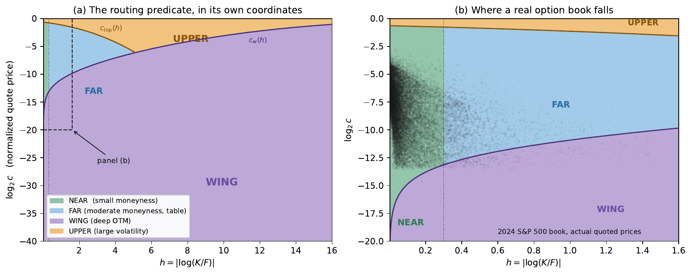
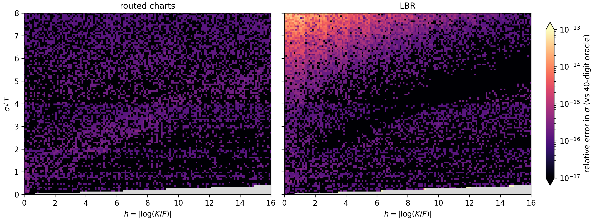
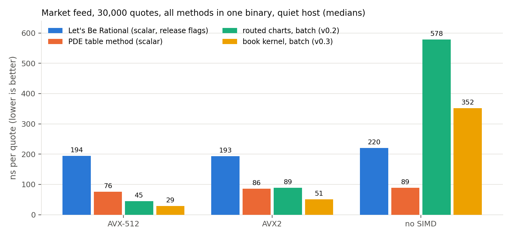
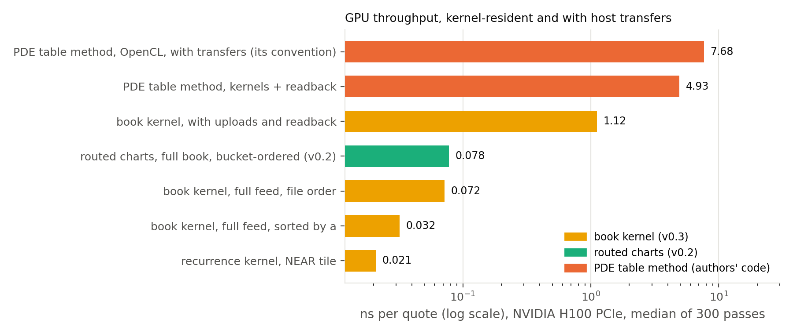

# volfi v0.3.1: Fast Implied Volatility

`volfi` is a header-only C++17 reference implementation for inverting the Black–Scholes
price-to-implied-volatility map at machine precision, at vector-hardware throughput.

Version 0.3 adds the **book kernel**: one straight-line evaluation, with a single branch and
a 63-term table, that answers all but three quotes in thirty thousand of a real S&P 500 book
without routing and without iteration. It rests on an exact result. In the inverse's own
coordinates the small-moneyness expansion has rational coefficients (every coefficient beyond
one tabulated function of one variable is a rational number, Proposition 1 of the paper), and
the same rows, re-expanded in a conformal variable, reach across the interior into the deep
wing. The routed four-chart inverter of v0.2 stays in the tree as the fallback behind it and
as the coverage of the whole feasible domain.

Everything is a fixed sequence of fused multiply-adds shared by the scalar entry, the AVX-512
and AVX2 twins and the CUDA port, so batched results are **bit-identical** across instruction
sets, compilers and the device.

The accompanying paper (`docs/volfi_v0.3.0_paper.pdf`, which still describes v0.3.0 and will be replaced when the v0.3.1 manuscript is final; *Implied Volatility in One Straight
Line: Machine Precision at Vector-Hardware Throughput*) documents the method, the accuracy
campaigns and the timing methodology in full. The PDF holds the five-section article followed
by its online appendix, which carries the proof of Proposition 1, the four routed charts, the
complete hot path, the offline construction and the extended benchmark tables.

## What it does

For an out-of-the-money normalized call with log-moneyness `h = |log(K/F)| > 0` and
undiscounted normalized price `c = C/F in (0,1)`, where

```
c = Phi(-h/v + v/2) - exp(h) * Phi(-h/v - v/2),   v = sigma*sqrt(T),
```

`volfi` returns the total implied variance `w = v^2` (and, on request, `sigma`).

**The book kernel** (`volfi_wb.hpp`). Form `a = log(1 + expm1(h)/c)`, the analyticity radius
of the fixed-price branch, and `A0 = a G(a)` from a one-variable table (23 terms on
`[0, 2 pi]`, 40 terms in `u = 1/sqrt(a)` on `[2 pi, 700]`). Below `a = 2 pi`, with
`theta = h/a <= 0.35`, the total volatility is `v = t S(t^2, A0^2)`, `t = h/A0`, where `S` is a
polynomial with exact rational coefficients (16 rows). Above `2 pi` the same rows, re-expanded
in the conformal variable `q = z/(sqrt(1+z)+1)^2`, `z = h^2/(4 pi^2)`, reach `h <= min(4,
0.16 a + 0.85)` (16 rows). A quote outside both regions falls through to the routed charts.

**The routed charts** (`volfi_annulus_all.hpp`; `UPPER` rebuilt in v0.3.1, the other three unchanged since v0.2.4). A branchless predicate routes
each `(h, c)` to one of four charts by two frozen seam polynomials and integer tests on the
IEEE-754 bit fields:

| chart   | region                                              | method                                                         |
|---------|-----------------------------------------------------|----------------------------------------------------------------|
| `NEAR`  | `h < 0.3`, below the ceiling                        | matched small-moneyness expansion                              |
| `FAR`   | `0.3 <= h <= 6.65`, between the two seams           | bivariate Chebyshev table in `W = h^2/(2w)`                    |
| `WING`  | `c < c_w(h) = C(h, h/sqrt(7.6))`, i.e. `W >= 3.8`   | resurgent deep-OTM evaluator (erf-free), prices to `1e-320`    |
| `UPPER` | `c > c_top(h) = C(h, 1.85)`, i.e. `v > 1.85`        | 13-coefficient endpoint seed + exactly one Householder step    |



*The routing predicate in the coordinates it actually uses: the input strip `0 < c < 1`
against moneyness, tiled by the four charts (left), and the near-the-money corner (right) with
a full year of tradeable 2024 S&P 500 quotes overlaid as their actual quoted prices. About 92%
of a real book is `NEAR`, 7% `FAR`, 1% `WING`, and none `UPPER`. The book kernel covers the
first three in one straight line.*

## Properties

- **Machine precision, uniformly.** Against a 40-digit `mpmath` oracle the entry point's worst
  relative error in `sigma` is `5.3e-16` (4 ULP) on a 20,000-point campaign concentrated on
  every switch of the book kernel, `5.3e-16` (3 ULP) on the 16,039-point regular grid, and
  `9.2e-16` for the routed charts alone; no validation set has a point above `1e-15`. The
  reference (Let's Be Rational) degrades to `5.1e-14` (426 ULP) near the intrinsic edge and in
  the subnormal-price wing, where `volfi` holds machine precision.
- **Deterministic across builds and architectures.** The scalar entry, the AVX-512 / AVX2
  twins and the CUDA device kernels produce **bit-identical** output, and all reference builds
  (gcc/clang × AVX-512/AVX2/scalar) agree bit for bit. This is guaranteed by compiling with
  `-ffp-contract=off` (`--fmad=false` on the device), which turns every fused multiply-add into
  an explicit `std::fma` in the source so codegen cannot vary the fusion by translation unit,
  ISA, or compiler.
- **Total input contract.** `implied_variance_otm_checked` classifies every input
  (`ok`, `below_intrinsic`, `above_max`, `bad_input`, `out_of_domain`, `near_saturation`)
  and never returns silent garbage; invalid domains yield `NaN`. The book kernel reports the
  region it answered from (`1` = raw rows, `2` = conformal rows, `0` = handed to the charts).
- **No data-dependent iteration anywhere.** Every kernel executes a fixed operation count, so
  per-quote cost has no tail and eight (four) quotes advance in lockstep.



## Performance (summary)

Measured on a quiet Intel Core i5-1145G7 (Linux, GCC 11.4, `-O3 -ffp-contract=off
-fno-fast-math -funroll-loops`), all methods in **one binary** timed by the same loop on the
same 30,000-quote market feed (2024 SPX end-of-day, tradeable, every route), every method
starting from the raw `(h, c)` pair. The reference is compiled from its author's sources at
the flags of its own Makefile; the PDE table method of Matić, Radoičić and Stefanica from its
authors' sources at its compile script's flags. Nanoseconds per quote, medians:

| build                     | Let's Be Rational | PDE method (scalar) | routed scalar / batch | **book kernel** scalar / batch |
|---------------------------|------------------:|--------------------:|----------------------:|-------------------------------:|
| AVX-512, full feed        | 193               | 78                  | 262 / 46              | 115 / **16.6**                 |
| AVX-512, batches of 64    |                   |                     | 75                    | **18.9**                       |
| AVX2, full feed           | 192               | 75                  | 263 / 85              | 116 / **23.2**                 |
| AVX2, batches of 64       |                   |                     | 109                   | **25.1**                       |

Medians of 31 passes of eight sweeps (`reproduce/book/results/cpu_all_v031_20260918_171645_clean.txt`).
The build without SIMD and without hardware fma was not re-measured for v0.3.1; its v0.3.0 row
(reference 220, book kernel 342 / 352) is in `cpu_all_20260914_185859_clean.txt`.



In this figure and the GPU one below, the blue shades mark the methods that hold machine precision on the feed (Let's Be Rational, the routed charts, the book kernel) and red marks the PDE table method, whose worst error on the same feed is 1.2e-5.

The book kernel's batch path is **11.6× (AVX-512) and 8.3× (AVX2) the reference's rate** and
4.7× the PDE method's scalar evaluation; its scalar entry is 1.7× the reference on the
vector-capable builds. Branch by branch on region-filtered tiles (`NEAR` / `FAR` / `WING`) the
batch path takes 15.6 / 16.4 / 20.7 ns against the reference's 186 / 245 / 249, and on a
synthetic `UPPER` tile (the feed has no such quotes) 33.9 ns against 187, with the scalar entry
at 161. In v0.3.0 link-time optimization on every side moved the reference's row by three
percent, so the translation-unit boundary is not what the table measures.

What changed against v0.3.0 (29 / 51 ns) is mostly the batch driver and not the arithmetic. One
loop over expm1, division, log1p, table and rows is a dependency chain longer than the core's
reorder window, so consecutive registers cannot overlap. v0.3.1 works through each tile in
passes with short bodies (the coordinate `a` first, then the kernels, region B as a table pass
and a row pass). Every lane executes the same operations as before, and batch == scalar holds
bit for bit.

Two limits, stated the same way in the paper. On the build without SIMD and without hardware
fused multiply-add every explicit `fma` becomes a library call, and the reference is the faster
scalar there. And the accuracy advantage does not show on tradeable quotes, where every solver
considered is at its design precision; there the case is throughput and determinism.

The one public **vectorized** port of the reference, fast-vollib (Saqur 2026, Numba backend,
one thread, same feed and host, loaded session), takes 411 ns per quote at a worst error of
`3.3e-14`: a masked whole-array Householder iteration is a factor of two behind the scalar C++
reference, not ahead of it.

### GPU

The same kernels, mirrored as CUDA device code operation for operation and compiled with
`--fmad=false`, return **bitwise identical doubles** to the CPU scalar entry on every quote. On
one NVIDIA H100 PCIe (CUDA 12.4), median nanoseconds per quote over 300 passes, the feed tiled
to about five million quotes:

| workload                                              | ns per quote |
|-------------------------------------------------------|-------------:|
| routed charts, full book, bucket-ordered              | 0.079        |
| recurrence kernel, `NEAR` feed tile                   | 0.021        |
| **book kernel, full feed, sorted by `a`**             | **0.031**    |
| book kernel, full feed, file order                    | 0.061        |
| book kernel with `UPPER` fallback, synthetic `UPPER` tile | 0.054    |
| `UPPER` chart alone, one step (v0.3.0, three steps: 0.173) | 0.045   |
| book kernel, with uploads and readback on every pass† | 1.12         |
| PDE method (OpenCL, authors' code), with transfers†   | 7.68         |

† Bound by the host link and not by the kernel. Both rows are from the v0.3.0 session, in which
both methods ran on the same card. The other rows are the v0.3.1 session
(`reproduce/book/results/gpu_v031_run_2026-09-18.txt`).



The book kernel is kernel-resident fp64 throughput on datacenter hardware; consumer GPUs run
double precision at 1/32 to 1/64 rate and will not reproduce it. The PDE method is six times
slower under its own transfer-inclusive convention and ten orders of magnitude less accurate on
the traded feed (`1.2e-5` worst against `6.2e-16`).

Both figures are regenerated from the checked-in results by `reproduce/book/gen/make_readme_figures.py`.
Sources in [`gpu/`](gpu). The device tables are generated from the CPU headers by
`gpu/make_near_cuda.py` (book kernel), `gpu/make_device_*.py` (routed charts) and
`gpu/make_upper1_cuda.py` (one-step `UPPER` constants and the device mirrors the book driver
includes); regenerate them before building, they are deliberately not checked in.

## Build and use

Header-only; no dependencies beyond the standard library.

```cpp
#include <volfi/volfi_wb_vec.hpp>       // the book kernel, scalar + SIMD twin (+ routed fallback)

// scalar: total variance w = v^2; code = 1 (raw rows), 2 (conformal rows), 0 (routed charts)
int code;
double w = volfi_wb::implied_variance_wb(h, c, &code);

// batch: a whole book at once, output bit-identical to the scalar entry, lane for lane
volfi_wb::implied_variance_wb_batch(h_arr, c_arr, w_out, code_out, n);
```

The routed inverter of v0.2.4 is unchanged and remains the general-purpose entry:

```cpp
#include <volfi/volfi_annulus_all.hpp>

double w     = volfi_annulus::implied_variance_otm(h, c);        // total variance v^2
double sigma = volfi_annulus::implied_volatility_otm(h, c, T);   // volatility
volfi_annulus::iv_status st;
double w2    = volfi_annulus::implied_variance_otm_checked(h, c, &st);
double sig   = volfi_annulus::implied_volatility(F, K, price, T, /*is_call=*/true, &st);
volfi_annulus::implied_variance_grid_batch(h_arr, c_arr, w_out, n);
volfi_annulus::implied_variance_warm_batch(h_arr, c_arr, w_prev, w_out, n, /*steps=*/2);
```

Compile a translation unit that uses the batch drivers with, e.g.

```
g++ -std=c++17 -O3 -march=native -ffp-contract=off -fno-fast-math  your_code.cpp
# AVX2-only host:  -mavx2 -mfma -mno-avx512f   (instead of -march=native)
```

`-ffp-contract=off` is required for the bit-identity guarantee. Never use `-ffast-math`.

## Verification and benchmarks

`reproduce/` holds the v0.2.4 suite (accuracy, bit-identity, timing, golden oracle vectors,
the exact build protocol and the reference run outputs), and `reproduce/book/` the v0.3.0 and v0.3.1
campaign: the book kernel's gates, the 40-digit truth sets including the 20,000-point
boundary campaign and its scorer, the one-binary CPU harness with the reference and the PDE
method, the branch-wise harnesses, the node-persistence measurement, the exact-row generator,
and the raw outputs of the quiet-host and H100 runs. See [`reproduce/README.md`](reproduce/README.md)
and [`reproduce/book/README.md`](reproduce/book/README.md).

```
make book      # book kernel: SIMD twin == scalar on 393,806 quotes, 2.39 ULP worst on the truth set
make check     # v0.2.4 suite: SMOKE PASS, BIT-IDENTITY grid=0 permuted=0 fixed-h=0, pts>1e-15 = 0
```

Three inputs are **not redistributed** because their licences are not ours to pass on: the
market feed and everything derived from it (a licensed OptionMetrics file; the recipe to
regenerate it from your own licence is in `reproduce/README.md`), Jäckel's *Let's Be Rational*
sources (http://www.jaeckel.org/), and the PDE method's sources and 46 MB table
(https://github.com/maticivan/PDE-method-for-implied-volatility). The verification suite and
every accuracy table run without them; the comparison harnesses take their paths as arguments.

## Documentation

- [`docs/volfi_v0.3.0_paper.pdf`](docs/volfi_v0.3.0_paper.pdf) — the paper (method,
  Proposition 1 with its deck-involution derivation, accuracy campaigns, like-for-like timing
  on CPU and H100) followed by the online appendix (proof, routed charts, hot path, offline
  construction, extended benchmarks, reproducibility).
- [`docs/README.md`](docs/README.md) — documentation index.
- [`CHANGELOG.md`](CHANGELOG.md) — what changed in v0.3.1 and v0.3.0.

## Domain conventions

- OTM functions require `h > 0` and `0 < c < 1`.
- The raw-data wrapper `implied_volatility(F, K, price, T, is_call, ...)` accepts either side
  and projects to the OTM-call twin by put–call parity.
- For `v > 8` the accuracy floor is set by the representability of `1 - c` in double precision,
  not by the method; such inputs are flagged `near_saturation`. This limit is intrinsic to a
  double-precision price input and applies to any inverter.
- Invalid domains return `NaN`.

## Bindings

The Python (`bindings/python`) and R (`bindings/r`) bindings expose the book kernel
(`volfi.implied_variance_book(h, c)` returning `(w, code)` and `implied_volatility_book`;
`volfi_w_book(h, c)` returning `$variance` and `$region`, and `volfi_iv_book` in R) alongside the
routed v0.2 API, which is unchanged. Both report version 0.3.1, and both test suites pass.

## Citation

If this software, method, or benchmark informs research, software, or published results,
please cite the repository and the accompanying paper (`docs/volfi_v0.3.0_paper.pdf`). See
[`NOTICE.md`](NOTICE.md).

## License

BSD 3-Clause. See [`LICENSE`](LICENSE).
